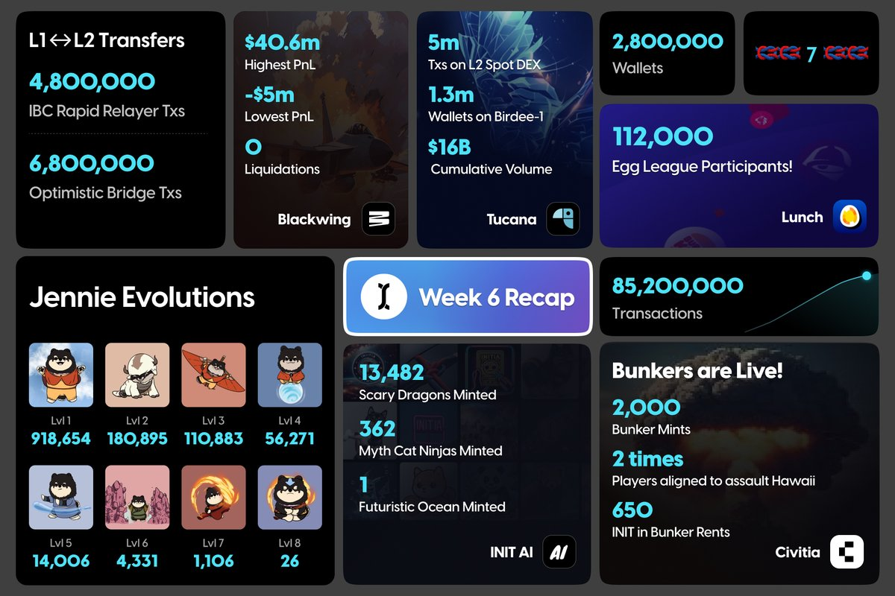

# 🚀 INITIA

Initia is an L1 on Cosmos with application-specific L2s (Layer 2) using Optimistic rollups. Through Initia’s architecture, encompassing the L1, L2, and communication layers, developers can easily launch application-specific blockchains as Initia L2s without needing to know complex chain-level infrastructure or run validator sets. Project teams can design their own economy and user experience, incorporating features like native stablecoin and multi-chain bridging, in addition to just-in-time gas, ecosystem-wide asset fungibility, programmatic gas-free transactions, and account abstraction.

<figure><figcaption></figcaption></figure>

<figure><figcaption></figcaption></figure>

Website ⚡️[https://initia.xyz/](https://initia.xyz/)\
Testnet ⚡️ [app.testnet.initia.xyz/xp](http://app.testnet.initia.xyz/xp) - LNDEQC85\
Explorer ⚡️ [scan.testnet.initia.xyz/initiation-1/](http://scan.testnet.initia.xyz/initiation-1/)\
Validator ⚡️ [https://scan.testnet.initia.xyz/initiation-1/validators/initvaloper13nwzm5dfd26ue74jr6sc39gyn3qze0rjahfguc](https://scan.testnet.initia.xyz/initiation-1/validators/initvaloper13nwzm5dfd26ue74jr6sc39gyn3qze0rjahfguc)\
\
SERVICE NODE ⚡️ [https://main.bonynode.online/services/testnet/initia/](https://main.bonynode.online/services/testnet/initia/)

rpc ⚡️ [https://initia-testnet-rpc.bonynode.online/](https://initia-testnet-rpc.bonynode.online/)

rest ⚡️[ https://initia-testnet-api.bonynode.online/](https://initia-testnet-api.bonynode.online/)

Genesis ⚡️- [https://testnet-files.bonynode.online/initia/genesis.json](https://testnet-files.bonynode.online/initia/genesis.json)

snapshot⚡️ [https://testnet-files.bonynode.online/initia/snap\_initia.tar.lz4](https://testnet-files.bonynode.online/initia/snap\_initia.tar.lz4)

addrbook ⚡️ [https://testnet-files.bonynode.online/initia/addrbook.json](https://testnet-files.bonynode.online/initia/addrbook.json)

rpc scanner ⚡️ [https://main.bonynode.online/services/testnet/initia/public-rpc/](https://main.bonynode.online/services/testnet/initia/public-rpc/)\
\
Understanding Initia

Initia is designed to address the existing fragmented problem and at the same time remain the power of interoperability, scalability, security and flexibility. Built on CosmosSDK with Tendermint/CometBFT consensus mechanism. It enables seamless interaction between different blockchain networks, facilitating a more connected and efficient decentralized ecosystem. Initia's unique architecture includes the Initia Virtual Machine (InitiaVM) and robust cross-rollup transaction capabilities, ensuring high performance and scalability.

Complete architecture of Omnitia

Initia Virtual Machine (InitiaVM)

The InitiaVM is a specialized virtual machine that enhances the execution of smart contracts. It is optimized for cross-chain interactions, ensuring that transactions are executed smoothly across different blockchain networks. The InitiaVM supports multiple programming languages, providing developers with the flexibility to write smart contracts in their preferred language.

#### 1.2 Cross-Rollup Transactions 

Initia's cross-rollup transaction mechanism is a significant breakthrough, allowing assets and data to move seamlessly between different rollups. This capability ensures that users can interact with various decentralized applications (dApps) without worrying about the underlying blockchain infrastructure. By enabling efficient cross-rollup transactions, Initia significantly enhances the user experience and expands the potential use cases for blockchain technology.

#### 1.3 Omnified Bridges 

Initia’s use of native OPinit Bridge, IBC relayer technology, and AMM pools addresses economic inefficiencies and potential attacks, such as malicious operators exploiting liquidity. Significant stake deposits in the MinitSwap Pool prevent such exploits, ensuring a secure and efficient system for cross-rollup transactions.

#### 1.4 Modular design 

Unlike monolithic blockchains that integrate all functions into a single system, Initia employs a modular approach. By separating core functions from specific applications, Initia allows for quicker development and simpler upgrades. This design is akin to building blocks, where components can be easily swapped or updated without impacting the entire system.

#### 1.5 Enshrined Liquidity 

This distinctive mechanism establishes an integrated liquidity hub within Layer 1, enhancing security, facilitating token trading, and enabling seamless transfers across rollups, which benefits both users and developers.

### Developer and User Experience 

Initia places a strong emphasis on both developer and user experience. The platform offers comprehensive tools and resources for developers, including detailed documentation, SDKs, and APIs, which streamline the development process and reduce time-to-market for new applications.

Quickly develop roll-ups upon Initia with wide ranges of trusted tools

<figure><figcaption></figcaption></figure>

For users, Initia integrates features like guided bridges, universal wallets, and Just-in-Time (JIT) gas fee payments. These enhancements ensure a seamless and intuitive experience, making it easier for users to interact with different rollups and manage assets efficiently. Simplified Bridging and Asset Management Initia’s guided bridges eliminate the need for external bridging solutions, restoring ownership of bridges to users and the underlying ecosystem. Initia’s wallets allow users to browse assets on both L1 and L2 rollups, indexed by rollup-universal indexers, providing a seamless omnified user experience. Enhancing Transaction Experience Application-level UX extensions, such as JIT gas fee payments and native USDC support, significantly improve the user experience on Initia. JIT enables users to pay gas fees with any token, while USDC from the Noble appchain mitigates risks associated with synthetic stablecoins, ensuring easy transactions.

### &#x20;Security and Scalability 

Security is paramount in the blockchain space, and Initia employs state-of-the-art cryptographic techniques to safeguard user assets and data. The platform's consensus mechanism is designed to resist common attack vectors, ensuring the integrity and reliability of the network. Scalability is another critical aspect of Initia's design. The platform leverages advanced technologies such as sharding and off-chain processing to handle a high volume of transactions without compromising on performance. This scalability makes Initia well-suited for a wide range of applications, from financial services to supply chain management.

#### Ecosystem and Partnerships 

Initia has established a robust ecosystem through strategic partnerships and collaborations. The platform's open and inclusive approach has attracted a diverse array of projects and developers, fostering innovation and growth within the ecosystem.

The ecosystem is expanding everyday!

<figure><figcaption></figcaption></figure>

Trusted backers such as Binance Labs, Hack VC and Delphi Capital, these collaborations have enabled Initia to integrate with various blockchain networks, enhancing its interoperability and expanding its user base.

Stay tuned for more exploding partnerships!

<figure><figcaption></figcaption></figure>

### Real-World Applications and Use Cases 

Initia’s innovations are not just theoretical—they have practical applications that can transform various industries. Here are a few detailed examples of how Initia’s solutions can be applied:

#### Decentralized Finance (DeFi) 

#### Enhanced Liquidity and Asset Management 

In the DeFi sector, liquidity is paramount. Initia’s secure and efficient cross-rollup transactions can significantly enhance liquidity and asset management. By enabling seamless interactions between different rollups, Initia reduces the complexity and risks associated with cross-chain DeFi operations.

Example: A decentralized exchange (DEX) built on Initia can facilitate instant and secure trading of assets across multiple rollups. Traders can benefit from lower fees and faster transactions, while liquidity providers enjoy a unified pool of assets that maximizes yield opportunities. A specific example would be Lunch App - the All-In-One Web3 Consumer App bridging Web3 with the real world, allowing users to earn rewards for engaging in activities across Web3 & Web2 which is built on Initia, offering wide ranges of applications such as Perpetual DEX, launchpad, games.

#### Improved User Experience 

DeFi platforms often struggle with user onboarding and transaction complexity. Initia’s universal wallet and JIT gas fee payments simplify the user experience, making DeFi more accessible to a broader audience.

Example: A lending protocol using Initia can allow users to deposit assets on one rollup and borrow on another, with all transactions managed seamlessly through a single interface. Users no longer need to juggle multiple wallets or worry about gas fees in different tokens.

#### Gaming 

#### Seamless In-Game Economies 

Gaming platforms often face issues with asset security and ownership verification. Initia’s robust security features and interoperable bridges ensure that players have true ownership of their in-game assets, which can be securely transferred or sold.

Example: An esports platform can use Initia to verify and transfer ownership of digital collectibles and rewards. Players can trust that their achievements and items are secure, and can easily transfer them between games or sell them on secondary markets

<figure><figcaption></figcaption></figure>

## Team 

Two of Initia’s core developers, Zon and Stan Liu, were working at Terraform Labs during its heyday. Zon was a smart contract developer while Liu was researching MEV.

After leaving Terraform Labs , they start to build a new Cosmos-based DeFi blockchain. After Terra collapsed, they paused their project and returned funds to investors. They re-evaluated their direction, seeking to create greater value and innovation in the blockchain space, and ultimately focused on Initia.

The Initia team, with over 20 members, brings extensive experience from the Cosmos, Terra, and Ethereum ecosystems, as well as backgrounds in FAANG and top quant firms. They have built numerous DeFi dApps, managed and evolved multiple blockchains, and contributed significantly to Cosmos Core and CosmWasm. Key achievements include developing the Station Wallet (5.3M downloads, 100k+ DAU) and supporting infrastructure for 700k+ daily transactions on Terra.

## Funding 

In Oct 2023, Binance Labs has announced that they invested in Initia.

Yi He, Co-Founder of Binance and Head of Binance Labs, commented:

> “Binance Labs is continually identifying infrastructure providers introducing novel solutions to accelerate the growth of Web3 applications. Initia’s innovative architecture and tooling is a step forward towards widespread adoption among a new wave of developers.”

<figure><figcaption></figcaption></figure>

In Feb 2024, Initia announced they raised another $7.5M in seed round, this round is leaded by Delphi Ventures and HackVC , the participants including [Nascent](https://www.nascent.xyz/), [Figment Capital](https://www.figmentcapital.io/), [A.Capital](https://acapital.com/), [BigBrain Holdings](https://www.bigbrain.holdings/).

<figure><figcaption></figcaption></figure>

There are also angels and thought leaders in the space participated this round, including [Cobie](https://twitter.com/cobie), [DCF GOD](https://twitter.com/dcfgod), [Zaheer](https://twitter.com/SplitCapital), [Nick White](https://twitter.com/nickwh8te), [Smokey](https://twitter.com/SmokeyTheBera) and many more.

## Omnitia Architecture 

Initia introduces a foundational Layer 1 blockchain integrated with a bespoke Layer 2 infrastructure which called **Omnitia**, fostering a cohesive ecosystem of modular networks.

<figure><figcaption>
Initia architecture
</figcaption></figure>

### Initia (Layer 1) 

The Layer 1 built on the Cosmos SDK, using CometBFT for consensus and integrating the Move VM for smart contracts, it serves as an orchestration layer coordinating security, liquidity, routing, and interoperability.

<figure><figcaption>
Initia L1
</figcaption></figure>

**Key Features**

* **Omnitia Liquidity Hub and Enshrined Liquidity:** Staking INIT tokens with validators enhances security and liquidity, creating a liquidity hub within the L1 chain. This mechanism allows for the staking of INIT tokens or paired tokens, which boosts staking rewards and facilitates seamless token transfers across rollups.

<figure><figcaption>
Omnitia Liquidity Hub
</figcaption></figure>

* **Omnitia Shared Security (OSS):** A scalable security framework that protects assets across multiple Minitias. OSS leverages Celestia’s data availability solutions, enabling efficient data verification and the construction of fraud proofs without the need to download entire blocks. This system ensures that the L1 validator set can maintain security across the network without being burdened by the full data load of every Minitia.

<figure><figcaption>
Omnitia shared security
</figcaption></figure>

### Minitia (Layer 2) 

The Layer 2 infrastructure consists of Minitias, high-performance application chains designed for scalability and throughput, operating with the VM-Agnostic Optimistic Rollup framework.

**The OPinit Stack**

OPinit Stack is a pioneering optimistic rollup framework tailored for the Cosmos ecosystem, inspired by Optimism’s Bedrock specification. Its VM-agnostic nature allows Minitias to support various virtual machines, including MoveVM, WasmVM, and EVM, catering to diverse applications and developer preferences.

<figure><figcaption></figcaption></figure>

### Minitia 

<figure><figcaption></figcaption></figure>

Minitias are full-featured CosmosSDK chains relying on the Initia Layer 1 for security and data settlement. This allows Minitias to leverage advanced rollup functionalities and use various CosmosSDK modules.

Transactions on Minitias are efficiently sequenced and settled in bulk to the L1 and Celestia, ensuring a transparent and secure environment for operation and verification.

**Key features**

1. **Comprehensive Built-in Features**

* **Developer Tools and Features:** Minitias offer a suite of built-in features for developers, including instant bridging, native USDC, token fungibility across different virtual machines, oracle interfaces, fiat gateways, and extensive developer tools.

2\. **Impressive technical specifications and a rich feature set**

* **Performance:** over 10,000 TPS with 500ms block times, ensuring high performance for demanding applications.
* **Interoperability:** Integrated with IBC for Cosmos interoperability and Omnitia Shared Security.
* **Support for Celestia Data Availability:** Leveraging Celestia for efficient data availability and state verification.
* **MultiVM Support:** Support MoveVM, WasmVM, and EVM
* **Various Native Features**:Such as vested interest programs, token kickbacks, and an Omnitia Messaging Module
* **Advanced tooling:**Including the InitiaSDK, WalletSDK, and 1-Click Deposit Widget
* **Third-Party Integration:** Supports integration with external services and oracles to expand functionality and user experience.

## Aligning Omnitia 

Initia aligns the ecosystem by programmatically parametrizing the distribution of INIT and empowering dApps to directly capture economic value generated.

**Enshrined Liquidity**

<figure><figcaption></figcaption></figure>

Initia’s Delegated Proof of Stake (DPoS) mechanism, enhanced by the x/mstaking module, allows staking of solo INIT or whitelisted INIT-X LP tokens. This system mobilizes assets, diversifies security, enhances rewards, and boosts liquidity. It also facilitates inter-minitia routing and gas payments using whitelisted LP tokens.

**Vested Interest Program (VIP)**

VIP aligns users and maintains activity through long-term incentives that benefit all ecosystem participants. It ensures that Layer 2 activities accrue value within the Initia ecosystem and incentivizes developers to integrate INIT and engage users.

**Kickbacks**

<figure><figcaption></figcaption></figure>

Value is captured from economic activities by splitting transaction fees at the smart contract level, ensuring all participants benefit from the ecosystem’s economic activities.

## Spotslight 

### MoveVM 

<figure><figcaption></figcaption></figure>

Move is a blockchain-agnostic language designed for security and productivity, simplifying the Web3 learning curve. Originally developed for the Diem blockchain and based on Rust, Move offers first-class abstractions for assets, transfers, and access control, ensuring safer and more efficient smart contract programming.

Initia is the first CosmosSDK chain that intergate Move programming language and its virtual machine.

Initia’s MoveVM integrates the Move Runtime with the CosmosSDK, harmonizing token standards and allowing the use of Move coin within Cosmos. The Liquid Staking Module enables Move users to utilize Cosmos’ staking features. Initia also supports CosmosSDK messages within Move, enhancing functionality and interoperability for applications.

Also, this integration enable the interoperability of 3 most widely used VMs, EVM, WasmVM and MoveVM.

### InitiaEVM 

InitiaEVM is a CosmosSDK module designed to enable Solidity smart contracts and EVM operations while leveraging the interoperability of Cosmos and IBC.

<figure><figcaption></figcaption></figure>

* **Full EVM Compatibility**: Solidity contracts can be deployed or ported without modifications.
* **Custom Bank Interface (BI)**: Replaces the standard Cosmos x/Bank module with ERC20, ensuring a unified token standard across EVM Minitias.
* **Single Token Standard**: Only the ERC20 token standard is used, simplifying development and integration without the need to manage Cosmos coins or interfaces.
* **Native IBC Integration**:ERC20 tokens created within Solidity smart contracts can be transferred to other chains via IBC without additional complexity. Native Cosmos assets transferred to an EVM Minitia are automatically converted to ERC20 tokens.
* **Cosmos Interactions**: Solidity contracts can execute Cosmos messages, query chain state, and interact with features like Interchain Accounts, ICQ, and Slinky queries.
* **Interwoven EVM**: EVM IBC hooks support multi-chain, cross-VM contract interactions, facilitating a new multi-chain ecosystem.
* **Simplified Development:** InitiaEVM ensures easy integration for Solidity projects, allowing developers to focus on their applications without worrying about conversions or interoperability issues.

### Slinky 

<figure><figcaption>
Slinky
</figcaption></figure>

The Initia Layer 1 (L1) ecosystem features an advanced Enshrined Oracle system powered by Skip Slinky, delivering up-to-date price data directly to the chain with each block. This ensures reliable, accurate, and timely data for financial operations and smart contract functionalities.

Using Skip Slinky, developers can enhance their Initia L1 applications with reliable data, improving functionality and user experience for financial dApps, gaming platforms, and other applications requiring external data.

### Core Apps 

Initia provide a entire product stack unifies the architecture, offering users a singular chain experience when interacting with thousands of interwoven rollups and reducing entry barriers.

<figure><figcaption></figcaption></figure>

* [**InitiaScan**](https://scan.testnet.initia.xyz/mahalo-2)**:** A multi-chain explorer with VM-specific tools and information.
* [**Wallet Widget**](https://www.npmjs.com/package/@initia/react-wallet-widget)**:** Supports EVM & Cosmos wallet signing and includes social login features.
* **Bridget:** A frontend bridge/on-ramp aggregator integrated directly into rollups.
* [**Initia App**](https://app.testnet.initia.xyz/)**:** A centralized platform for all things related to Initia.
* [**Initia Usernames**](https://usernames.testnet.initia.xyz/)**:** A blockchain-wide on-chain identity system.
* [**Initia Wallet**](https://chromewebstore.google.com/detail/initia-wallet/ffbceckpkpbcmgiaehlloocglmijnpmp)**:** A dedicated wallet designed for navigating the expansive Initia ecosystem.

## Ecosystem 

<figure><figcaption></figcaption></figure>

Minitias are Layer 2 application chains within the Initia ecosystem. So far, there are 9 known high quality Minitias. (Maybe more)\

&#x20;                                     [Website](https://initia.xyz/) | [Discord](https://discord.gg/initia) | [Twitter](https://x.com/initiaFDN) | [Documents](https://docs.initia.xyz/)
